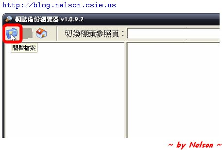
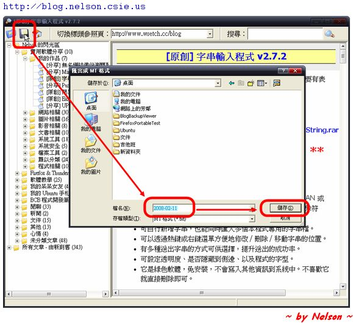
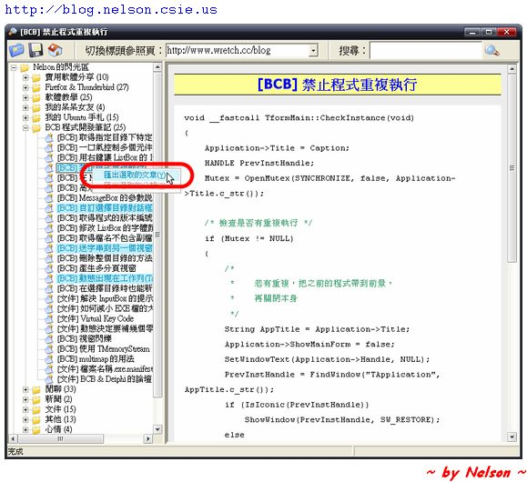

### 1.
將程式下載並解壓縮之後，雙擊「BlogBackupViewer.exe」即可執行程式。點選畫面左上方的按鈕來開啟要瀏覽的備份檔。

### 2.
你也可以將檔案另存為 MT 格式。

### 3.
本程式也提供了搜尋的功能，它會搜尋文章的標題跟內文。你只要在右上角的搜尋框輸入要搜尋的關鍵字，再按下「Enter」鍵或是右邊那個放大鏡圖示按鈕就行了。那若是想要清除搜尋結果又要怎麼做呢？很簡單，只要將搜尋框清空再按下「Enter」鍵或是放大鏡圖示按鈕即可。

### 4.
或許你有在創作小說、或許你跟我一樣有在寫心得或教學文章，你希望將這些文章分享給你的朋友們，但又不可能給對方整份備份檔，要一篇一篇複製出來又太累人，這時該怎麼辦呢？本程式提供了將文章匯出成 MT 格式的功能，你只要選好要匯出的文章（可以配合 Ctrl 或 Shift 鍵選擇多篇文章），再按下滑鼠右鍵選擇【匯出選取的文章】即可。

P.S.：只能選取 **同一分類** 底下的文章。

### 5.
若你要匯出好幾個分類，使用上一個方法未免太累了，這裡有更好的作法。你可以選好要匯出的分類（配合 Ctrl 或 Shift 鍵可以選取多組分類），然後按下滑鼠右鍵選擇【匯出選取的分類】就行了。

P.S.：只能選取 **同一層** 的分類。

