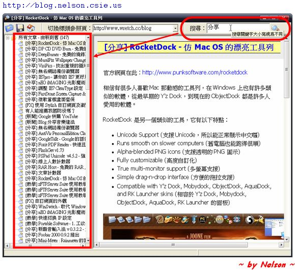
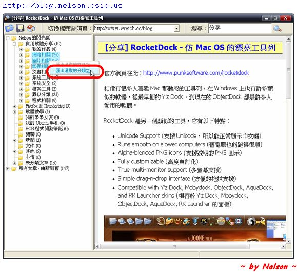

部落格備份瀏覽器
=============

本程式是一個支援 MovableType 備份格式的閱讀器，可以讀取以及匯出 MovableType 格式，（運氣好的話）也可以讀取無名小站的 XML 備份格式。

本程式用 Borland C++ Builder 6 配合 TntWare Delphi Unicode Controls 元件開發。

注意事項
=======

* 本程式支援讀取與匯出 MovableType(MT) 備份格式
* 本程式理論上支援無名小站的 XML 備份格式，但由於種種原因，所以很有可能無法讀取。現在無名小站也有提供 MovableType(MT) 備份格式了，請改用這個格式。
* 請不要問我哪裡找得到 Borland C++ Builder 6 或 TntWare Delphi Unicode Controls，我也不知道。
* 這是我在 2008 年開發的小玩具，本程式已經停止開發，有任何建議或使用上遇到任何問題，請 ***不要回報***。
* 最後再強調一次：本程式已經停止開發，有任何建議或使用上遇到任何問題，請 ***不要回報***

使用說明
=======

* 本程式操作方式可以參考[使用說明](./Doc/使用說明.md)。
* 單純只是想下載執行檔或原始碼，可以來這裡[打包下載](https://github.com/chiahsien/BlogBackupViewer/releases)。
* 歡迎 fork！

程式擷圖
=======

版權宣告
=======
[The MIT License (MIT)](./LICENSE)

Copyright (c) 2013 Nelson

Permission is hereby granted, free of charge, to any person obtaining a copy of
this software and associated documentation files (the "Software"), to deal in
the Software without restriction, including without limitation the rights to
use, copy, modify, merge, publish, distribute, sublicense, and/or sell copies of
the Software, and to permit persons to whom the Software is furnished to do so,
subject to the following conditions:

The above copyright notice and this permission notice shall be included in all
copies or substantial portions of the Software.

THE SOFTWARE IS PROVIDED "AS IS", WITHOUT WARRANTY OF ANY KIND, EXPRESS OR
IMPLIED, INCLUDING BUT NOT LIMITED TO THE WARRANTIES OF MERCHANTABILITY, FITNESS
FOR A PARTICULAR PURPOSE AND NONINFRINGEMENT. IN NO EVENT SHALL THE AUTHORS OR
COPYRIGHT HOLDERS BE LIABLE FOR ANY CLAIM, DAMAGES OR OTHER LIABILITY, WHETHER
IN AN ACTION OF CONTRACT, TORT OR OTHERWISE, ARISING FROM, OUT OF OR IN
CONNECTION WITH THE SOFTWARE OR THE USE OR OTHER DEALINGS IN THE SOFTWARE.
